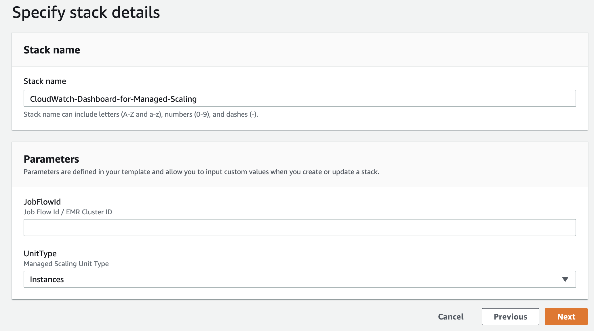
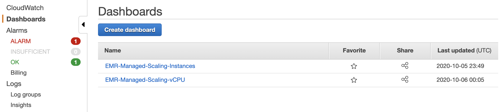
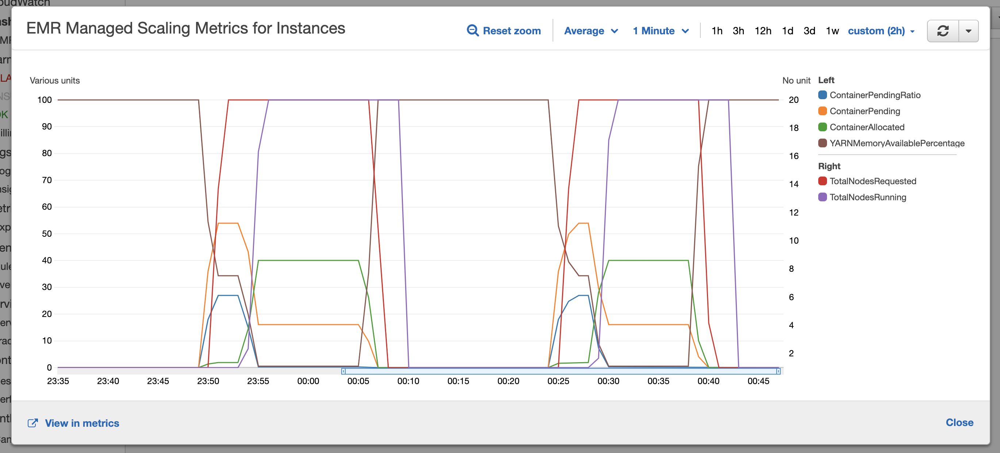

# AWS CloudWatch Dashboard for Amazon EMR Managed Scaling

With Amazon EMR versions 5.30.0 and later (except for Amazon EMR 6.0.0), you can enable EMR managed scaling to automatically
 increase or decrease the number of instances or units in your cluster based on workload. 

Amazon EMR publishes high-resolution metrics with data at a one-minute granularity when managed scaling is enabled for a 
cluster. You can view events on every resize initiation and completion controlled by managed scaling using Amazon EMR console 
or Amazon CloudWatch console. To learn more about Managed Scaling Metrics, please check [Understanding Managed
 Scaling Metrics](https://docs.aws.amazon.com/emr/latest/ManagementGuide/managed-scaling-metrics.html).

This solution will help you to create a useful pre-configured AWS CloudWatch dashboard to understand how EMR Managed
 Scaling is working, and visualizing how it's scaling your EMR cluster based on your workloads.
 
# Solution Walkthrough

To launch this CloudFormation stack, click on Launch Stack below:

This stack takes two parameters
- **JobFlowId**: Pass your EMR cluster id (e.g. j-xxxxxxx). This is the cluster which you configured with managed
 scaling
. CloudWatch dashboard will use the metrics produced by this cluster. 
- **UnitType**: The unit type which you are using for Managed Scaling. For instance groups, it's either Instances or
 vCPU. For Instance Fleet, it's InstanceFleetUnits. Depending on the unit type, EMR feeds different metrics to
 CloudWatch. In this solution, you select the UnitType, the solution creates the dashboard based on the corresponding
 metrics.

Once the CloudFormation stack is launched, you can go to the AWS CloudWatch console and check the dashboard created
 for Amazon EMR Managed Scaling. You can execute a job to trigger managed scaling. If the cluster previously ran
 job which triggered managed scaling, make sure you change the time window.

You can click on **Enlarge** option from the drop-down to expand the dashboard. The following picture shows two
 difference occurrence of scale out/in actions when using UnitType=Instances. Purple line represents number of running
  nodes, red line represents requested new nodes. As you notice here, **YARNMemoryAvailablePercentage** (burgundy line)
drops from 100% to < 1%, during that time, EMR requested additional nodes to finish the running job. Within few
 moments, additional nodes added to the cluster and **TotalNodesRunning** increased from 1 to 20. You can also try
  this solution with other unit types.

The intent of this solution is to give you a head start by creating the right CloudWatch dashboard for your EMR
 Managed Scaling Cluster. Feel free to fine tune your CloudWatch dashboard based on your requirement.